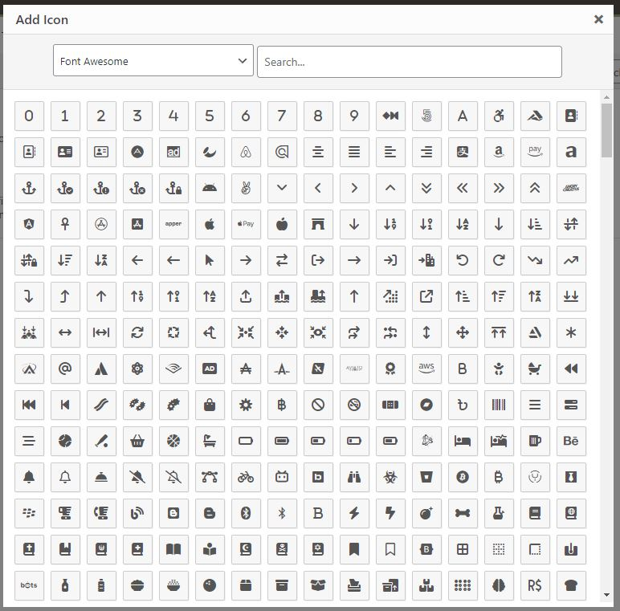

# Icon Select <Badge text="field" type="warn"/>

The entire purpose of the Icon Select field is to reduce time as a developer by feeding a web font CSS file via a URL and having it automatically parse the font class names. If required, specify a font prefix, and Icon Select will also auto-append it.
Ultimately, a fully functional class is output within the HTML of the theme. Icon Select will also enqueue the specified CSS file in the admin and/or front end.

<span style="display:block;text-align:center"></span>

::: warning Table of Contents
[[toc]]
:::

::: tip Getting Started
To understand how to use extensions, read this article on [Using Extensions](../guides/basics/using-extensions.md).
Please understand that a working knowledge of PHP and CSS is required to use this extension properly. Should you not be familiar with one or the other (or both), please refer to the following guides to get you started:
[Getting Started with PHP](http://www.php.net/manual/en/tutorial.php),  
[CSS Introduction](http://www.w3schools.com/css/css_intro.asp).
:::

## Arguments
By default, if you do not specify any particular arguments, Icon Select will load the FontAwesome, Elusive, and Dashicons sets already included with Redux and WordPress. It will also enqueue this font in the front end, so you can begin working with icons instantly. Alternatively, you can also provide any of the arguments below for a more customized experience.

| Name             | Type   | Default       | Description                                                                                                                                                                                |
|------------------|--------|---------------|--------------------------------------------------------------------------------------------------------------------------------------------------------------------------------------------|
| type             | string | `icon_select` | Value idenfitying the field type.                                                                                                                                                          |
| id               | string |               | Unique ID identifying the field. Must be different from all other field IDs.                                                                                                               |
| title            | string |               | Displays the title of the field.                                                                                                                                                           |
| subtitle         | string |               | Subtitle display of the field, situated beneath the title.                                                                                                                                 |
| desc             | string |               | Description of the field, appearing beneath the field control.                                                                                                                             |
| class            | string |               | Appends any number of classes to the field's class attribute.                                                                                                                              |
| default          | string |               | Specify a full font class name with the prefix as well                                                                                                                                     |
| stylesheet       | array  |               | Array of options that sets an entry into the Icon Select field. See `Stylesheet Options` below.                                                                                            |
| enqueue          | bool   | `true`        | You can disable the enqueing of this font in the admin panel, but I don’t know why anyone would want to do that.                                                                           |
| enqueue_frontend | bool   | `true`        | Use this to disable the enqueuing of your font in the front-end if you’ve already done so in your own code.                                                                                |
| compiler         | bool   | `false`       | Flag to run the compiler hook.                                                                                                                                                             |
| required         | array  |               | Provide the parent, comparison operator, and value which affects the field's visibility.                                                                                                   |
| hint             | array  |               | Array containing the `content` and optional `title` arguments for the hint tooltip.                                                                                                        |

::: tip Also See
- [Using the `compiler` Argument](../configuration/fields/compiler.md)
- [Using the `hints` Argument](../configuration/fields/hints.md)
- [Using the `permissions` Argument](../configuration/fields/permissions.md)
- [Using the `required` Argument](../configuration/fields/required.md)
:::

## Stylesheet Options
We've included four example in the Redux sample config and is show below. You are also free to use the examples in your project.

| Name    | Type   | Default       | Description                                                                                                                                                                                                                                                                                                                                                                                                         |
|---------|--------|---------------|---------------------------------------------------------------------------------------------------------------------------------------------------------------------------------------------------------------------------------------------------------------------------------------------------------------------------------------------------------------------------------------------------------------------|
| url     | string |  | URL to the stylesheet containing the font icons.                                                                                                                                                                                                                                                                                                                                                                    |
| title   | string |  | The title of the font icon set to appear in the Icon Select dropdown.                                                                                                                                                                                                                                                                                                                                               |
| class   | string |  | (Optional) Some font frameworks append a class prefix to denote their class. Specify that class prefix here. For example, Elusive Font requires the class prefix `el`.                                                                                                                                                                                                                                              |
| icons   | array  |  | (Optional) Specify an array of fonts to bypass the auto-parsing of CSS font icon stylesheets. Include base class name if needed. Example: `array( 'font-name-1', 'font-name-2', 'etc' )`                                                                                                                                                                                                                            |
| exclude | array  |  | (Optional) Icons to exclude from the font set. Must be in array format. Example: `array( 'icon-to-exclude1', 'icon-to-exclude-2', 'etc' )`                                                                                                                                                                                                                                                                          |
| regex   | array  |  | It's possible Icon Select's CSS parser may not always work with all icon set styles sheets. Specify a reguar expression pattern here if needed. This is an advanced feature that requires knowledge of [Regular Expression](https://www.regular-expressions.info/). We do not offer support for building working RegEx patterns. Use [https://regex101.com](https://regex101.com) to build and test RegEx patterns. |

## Example Config

```php
Redux::set_field( 
    'OPT_NAME', 
    'SECTION_ID', 
    array(
        'id'               => 'icon-select',
        'type'             => 'icon_select',
        'title'            => esc_html__( 'Icon Select', 'your-textdomain-here' ),
        'subtitle'         => esc_html__( 'Select an icon.', 'your-textdomain-here' ),
        
        // Default icon.
        'default'          => 'fas fa-1',

        // Enable/disable auto-enqueue of stylesheet in the admin panel.
        'enqueue'          => true,

        // Enable/disable auto-enqueue of stylesheet on the front end.
        'enqueue_frontend' => false,

        // Stylesheet data.
        'stylesheet'       => array(
            array(
                'url'    => 'https://cdnjs.cloudflare.com/ajax/libs/MaterialDesign-Webfont/7.2.96/css/materialdesignicons.css',
                'title'  => 'Material Icons',
                'prefix' => 'mdi-set',
            ),
            array(
                'url'    => 'https://icons.getbootstrap.com/assets/font/bootstrap-icons.min.css',
                'title'  => 'Bootstrap',
                'prefix' => 'bi',
            ),
            array(
                'url'    => 'https://cdn.lineicons.com/4.0/lineicons.css',
                'title'  => 'Line Icons',
                'prefix' => 'lni',
            ),
            array(
                'url'    => 'https://cdn.jsdelivr.net/gh/devicons/devicon@v2.15.1/devicon.min.css',
                'title'  => 'Dev Icons',
                'prefix' => '', // None needed.
            ),
        ),
    ) 
);
```

### Example Usage
This example in based on the example usage provided above. Be sure to change `$redux_demo` to the value you specified in 
your [opt_name](../configuration/global_arguments.md#opt-name) argument.

```php
global $redux_demo;

echo '<i class="' . $redux_demo['icon-select'] . '"></i>';
```
### Filter
In the event alternative output is required in the Icon Select field, the following filter may be applied. Please remember to replce `opt_name` with your project's `opt_name`.

| Tag                                              | Value                                                                          | Extra Args                                                                                                                                                                                                   |
|--------------------------------------------------|--------------------------------------------------------------------------------|--------------------------------------------------------------------------------------------------------------------------------------------------------------------------------------------------------------|
| 'redux/extension/icon_select/{opt_name}/output` | <b>$output</b> (string)<br/>The output string to replace the icon render HTML. | <b>$icon</b> (string)<br/>The name of the outputted icon.<br/><br/><b>$class</b> (string)<br/>The prefix class of the font set.<br/><br/><b>$selected_font_set</b>(string)<br/>The name of the currently selected icon set. |


### Filter Example
The example assumes the project's `opt_name` is `redux_demo`.
```php
add_filter( 'redux/extension/icon_select/redux_demo/output', 'redux_modify_icon_output', 10, 4 );

function redux_modify_icon_output( $output, $icon, $class, $selected_font_set ) {

    // We only want to filter output for a specific icon set, 
    // otherwise the icons for every icon set will be affected.
    if ( 'My Font Set' === $selected_font_set ) {
    
        // Let's say the icon name needs to be output for the <i> tag.
        // We'd make that change here.
        return '<i title="' . esc_attr( $icon ) . '" class="' . esc_attr( $class . ' ' . $icon ) . '" />' . esc_html( $icon ) . '</i>';
    }
}
```